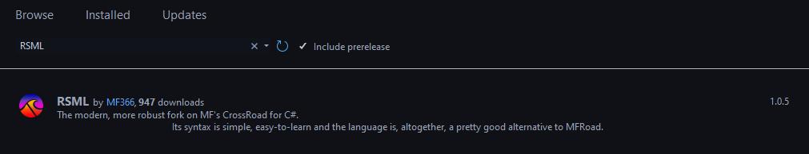
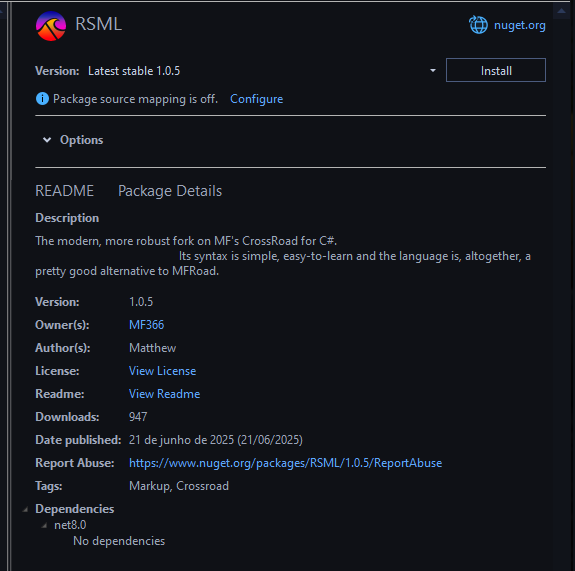

# RSML in C\#
RSML for C# is a great and solid choice for learning to use RSML programmatically, as it has the best support.

## Installation
RSML can be installed in 2 ways: **package reference** (via NuGet) or **project reference** (building RSML inside your solution).

### Package Reference
Installing RSML via its NuGet package is the recommended way to install RSML, as it guarantees stability.

=== ".NET CLI"
    Simply run the following line in the terminal.

    ```bash
    dotnet add package RSML --version 1.0.5
    ```

=== "Project File"
    To install RSML via your project file, simply ass the following line to an `#!xml <ItemGroup>`.

    ```xml
    <PackageReference Include="RSML" Version="1.0.5" />
    ```

=== "Visual Studio (PMC)"
    If you use Visual Studio, you can instead run the following line in the builtin **Package Manager Console**.

    ```powershell
    NuGet\Install-Package RSML -Version 1.0.5
    ```

=== "Visual Studio (GUI)"
    Visual Studio comes with a NuGet Package Installation GUI.

    1. **Select _Browse_ and search _RSML_.**

    { height="250" }
    /// caption
    Search _RSML_ on NuGet.
    ///

    2. **Choose the correct version and click _Install_.**

    { width="450" }
    /// caption
    Install _RSML_.
    ///

    3. If prompted to accept a license, do so.

### Project Reference _(Not recommended)_
If, for whatever reason, you need the latest nightly updates, you may also add the RSML project to your solution.

Please keep in mind that not all nightly updates are guaranteed to be bug-free or stable. Nightly updates are also not documented, only stable versions are.

```bash
cd YourSolution/YourProject/
# Assuming you've got the RSML project at YourSolution/RSML/
dotnet add reference ../RSML/RSML.csproj
```

1. If your solution is included in a `git` repository already, consider using [Git Submodules](https://git-scm.com/docs/git-submodule) instead.
