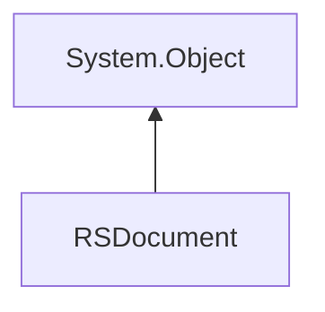

# `#!c# RSML.RSDocument` Class
Represents a Red Sea Markup Language document.

<!-- HIERARCHY -->

## Hierarchy

---

<!-- CONSTRUCTORS -->

## Constructors
`RSDocument` contains 3 constructor methods.

<!-- 1 -->

### `#!c# RSDocument(string rsml)`
Creates a new document from a string containing RSML.

#### Parameters
`#!c# string rsml`

:   The RSML data to load, in the form of a `#!c# System.String`.

<!-- 2 -->

### `#!c# RSDocument(StringReader reader)`
Creates a new document from a `#!c# StringReader` containing RSML.

#### Parameters
`#!c# StringReader reader`

:   The reader containing RSML.

<!-- 3 -->

### `#!c# RSDocument(RSParser parser)`
Creates a new document from a already initialized parser.

#### Parameters
`#!c# RSParser parser`

:   An instance of a Red Sea Markup Language parser.

<!-- STATIC FACTORIES -->

---

## Static Factories
`RSDocument` contains 2 static factory methods.

<!-- 1 -->

### `#!c# LoadRSMLFromFileIntoDocument(string filepath)`
Loads a RSML file into a `RSDocument`.

#### Parameters
`#!c# string filepath`

:   The path to the file to load.

#### Returns
**`RSDocument`** : The document containing ready-to-parse RSML.

<!-- 2 -->

### `#!c# NewFromFile(string filepath)`
Creates a new document from a filepath.

#### Parameters
`#!c# string filepath`

:   The path to the file to load.

#### Exceptions
`#!c# FileNotFoundException`
:   The file could not be located.

#### Returns
**`RSDocument`** : The document containing ready-to-parse RSML.

<!-- STATIC METHODS -->

---

## Static Methods
`RSDocument` contains 2 static _(non-factory)_ methods.

### `#!c# LoadRSMLFromFile(string filepath)`
Loads a RSML file into a string.

#### Parameters
`#!c# string filepath`

:   The path to the file to load.

#### Returns
**`System.String`** : The text contained in the file.

### `#!c# LoadRSMLFromFileAsync(string filepath)`
Loads a RSML file into a string, asynchronously.

#### Parameters
`#!c# string filepath`

:   The path to the file to load.

#### Returns
**`System.Threading.Tasks.Task<System.String>`** : The text contained in the file.

### `#!c# SaveRSMLToFile(string filepath)`
Saves RSML into a file.

#### Parameters
`#!c# string filepath`

:   The path to the file to write the RSML data to.

---

## Instance Methods
`RSDocument` contains 6 instance methods.

### `#!c# EvaluateDocument()`
Parses and evaluates the document.

#### Returns
`System.String`

:   The string matching the return value of the only match that had a primary operator.

`null`

:   There were no primary matches.

### `#!c# EvaluateDocument(string lineSeparation)`
Parses and evaluates the document.

#### Parameters
`#!c# string lineSeparation`

:   The custom line separation character to use, instead of `#!c# System.Environment.NewLine`.

#### Returns
`System.String`

:   The string matching the return value of the only match that had a primary operator.

`null`

:   There were no primary matches.

### `#!c# EvaluateDocument(bool expandAny, string? lineSeparation = null)`
Parses and evaluates the document.

#### Parameters
`#!c# bool expandAny`

:   If set to `#!c# true`, expands `any` into Regex expression `.+`, indicating that any RID will be a match.

`#!c# string? lineSeparation = null`

:   The custom line separation character to use, instead of `#!c# System.Environment.NewLine`. Defaults to `null`. If `null`, falls back to `#!c# System.Environment.NewLine`.

#### Returns
`System.String`

:   The string matching the return value of the only match that had a primary operator.

`null`

:   There were no primary matches.

### `#!c# EvaluateDocument(string customRid, string? lineSeparation = null)`
Parses and evaluates the document.

#### Parameters
`#!c# string customRid`

:   A custom RID to pass to the parser, instead of the host's RID.

`#!c# string? lineSeparation = null`

:   The custom line separation character to use, instead of `#!c# System.Environment.NewLine`. Defaults to `null`. If `null`, falls back to `#!c# System.Environment.NewLine`.

#### Returns
`System.String`

:   The string matching the return value of the only match that had a primary operator.

`null`

:   There were no primary matches.

### `#!c# EvaluateDocument(string customRid, bool expandAny, string? lineSeparation = null)`
Parses and evaluates the document.

#### Parameters
`#!c# string customRid`

:   A custom RID to pass to the parser, instead of the host's RID.

`#!c# bool expandAny`

:   If set to `#!c# true`, expands `any` into Regex expression `.+`, indicating that any RID will be a match.

`#!c# string? lineSeparation = null`

:   The custom line separation character to use, instead of `#!c# System.Environment.NewLine`. Defaults to `null`. If `null`, falls back to `#!c# System.Environment.NewLine`.

#### Returns
`System.String`

:   The string matching the return value of the only match that had a primary operator.

`null`

:   There were no primary matches.

### `#!c# ToString()`
!!! note
    `ToString()` overwrites parent class' `System.Object.ToString()`.

Returns the document's contents.

#### Returns
**`System.String`** : The loaded RSML.
